# Event Representations for Event Cameras

This repository implements a range of widely used event-camera representations and provides a framework for running them on your own HDF5 event files, visualizing the outputs, and saving the raw arrays when needed.

In particular, our implementation converts an event stream of the form `(x, y, t, p)` into image-like, tensor-like, or point-cloud-like representations that are easier to inspect or feed into downstream models.

## Citation

If you find this repository useful for your research, please consider giving it a star ⭐ and citing it. **More representations will come!**

Code:

```bibtex
@misc{Zou_2026_eventrepresentations,
  title        = {Event Representations for Event Cameras},
  author       = {Rong Zou},
  year         = {2026},
  note         = {GitHub repository},
  url          = {https://github.com/Rong-Zou/event_representations}
}
```

Data source:

```bibtex
@Article{Zou_2026_TRO,
  title     = {Event-Aided Sharp Radiance Field Reconstruction for Fast-Flying Drones},
  author    = {Rong Zou and Marco Cannici and Davide Scaramuzza},
  journal   = {IEEE Transactions on Robotics},
  publisher = {IEEE},
  year      = {2026},
}
```

## Table of Contents

- [Repo purpose](#repo-purpose)
- [Repo structure](#repo-structure)
- [Installation](#installation)
- [Quick start](#quick-start)
- [Configuration guide](#configuration-guide)
- [Visualization guide](#visualization-guide)
- [Available Representations](#available-representations)
- [References](#references)

## Repo purpose

Event cameras do not output conventional frames. Instead, they emit asynchronous events of the form `(x, y, t, p)`:

- `x, y`: pixel location
- `t`: timestamp
- `p`: polarity, typically `+1` for brightness increase and `-1` for brightness decrease

Many downstream models do not operate directly on raw events, so we usually convert the event stream into a more structured representation before visualization or learning.

This repo implements a collection of commonly used event representations together with:

- a config-driven demo runner
- HDF5 loading and slicing utilities
- visualization helpers
- optional raw-array export

## Repo structure

The structure of the repo is as follows:

```text
event_representations/
├── configs/
│   ├── event_repr_config_base.yaml      # broad parameter sweep config
│   └── event_repr_config_example.yaml   # smaller example config for saved demo figures
├── ev_representations/                  # core representation implementations
│   ├── average_timestamp_image.py
│   ├── distance_transform.py
│   ├── event_count_image.py
│   ├── event_polarity_sum_image.py
│   ├── event_spike_tensor.py
│   ├── mixed_density_event_stack.py
│   ├── normilized_point_cloud.py
│   ├── polarity_last_ternary_image.py
│   ├── polarity_sum_ternary_image.py
│   ├── stack_by_number.py
│   ├── stack_by_time.py
│   ├── tencode.py
│   ├── time_surface.py
│   ├── tore_volume.py
│   └── voxel_grid.py
├── ev_rep_vis/
│   └── examples/                        # example output images already rendered
├── event_repr_config.py                 # config schema, merging, CLI overrides
├── event_repr_data.py                   # HDF5 loading, polarity normalization, slicing
├── event_repr_demo.py                   # main CLI entry point
├── event_repr_runners.py                # runner registry for all representations
└── event_repr_vis.py                    # saving and visualization utilities
```

## Installation

Clone this repo.

```bash
git clone https://github.com/Rong-Zou/event_representations.git
```

Install the dependencies with:

```bash
pip install numpy h5py matplotlib pillow scipy pyyaml
```

Then run from the repository root:

```bash
cd event_representations
```

## Quick start

This repo expects an HDF5 file containing datasets named `x`, `y`, `t`, and `p`. Each dataset should be a 1D array of the same length, and the `i`-th entry in each array should correspond to the same event.

Conceptually:

```python
with h5py.File("events.h5", "r") as f:
    x = f["x"][:]
    y = f["y"][:]
    t = f["t"][:]
    p = f["p"][:]
```

### (1). Download a datapoint

The demo example uses data from the paper [Event-Aided Sharp Radiance Field Reconstruction for Fast-Flying Drones](https://github.com/uzh-rpg/event-sharp-nerf-drones).

Download the data from [here](https://download.ifi.uzh.ch/rpg/web/data/tro26_ev-deblur-drone/gen3_droneflight.zip).

Then change the path in `configs/event_repr_config_example.yaml` so it points to the downloaded HDF5 file.

### (2). Run the demo

```bash
python event_repr_demo.py --config configs/event_repr_config_example.yaml
```

Outputs are saved to:

- `paths.vis_dir`, if set
- otherwise `paths.vis_root / paths.dataset`

### (3). Other useful commands

Help:

```bash
python event_repr_demo.py --help
```

List the available representation names:

```bash
python event_repr_demo.py --list-representations
```

Merge multiple config files:

```bash
python event_repr_demo.py --config configs/event_repr_config_base.yaml configs/event_repr_config_example.yaml
```

Later config files override earlier ones. This is useful when you want a stable base config plus a small experiment-specific override file.

Override config values from the CLI:

```bash
python event_repr_demo.py \
  --config configs/my_config.yaml \
  --set paths.override_events_path=/absolute/path/to/events.h5 \
  --set paths.vis_dir=/absolute/path/to/output_dir \
  --set slice.t0=10000000 \
  --set slice.t1=10020000 \
  --set run.representations='["event_count_image", "time_surface", "voxel_grid"]'
```

Dump the default config to a YAML file:

```bash
python event_repr_demo.py --dump-default-config configs/defaults.yaml
```

Print the final merged config after loading from files and applying CLI overrides, then continue with the run:

```bash
python event_repr_demo.py --config configs/my_config.yaml --print-config
```

## Configuration guide

The config is built from five top-level sections:

- `paths`
  - input and output locations
  - `dataset` chooses between `default_real_events_path` and `default_syn_events_path`
  - `override_events_path` is usually the most convenient way to point to your own HDF5 file
- `slice`
  - selects the time window `[t0, t1)`
- `render`
  - `save`: save visualizations to disk
  - `save_raw`: also save raw arrays as `.npy`
  - `max_point_cloud_points`: cap the number of points used in point-cloud plots
- `run`
  - list of representations to execute
  - use `["all"]` to run everything
- `loops`
  - parameter sweeps for representations that have multiple variants

Common loop settings:

- `*_num_bins`: how many temporal bins or channels to use
- `*_measurements`: which value each event contributes
  - `count`: each event contributes `1`
  - `timestamp`: each event contributes a normalized timestamp
  - `polarity`: each event contributes `+1` or `-1`
- `*_split_polarity` or `*_separate_polarity`
  - whether positive and negative events are stored in separate channels

## Visualization Guide

The visualizer in this repo is designed to be informative. A few conventions are important when reading the saved PNGs.

### Split polarity

If polarity is split, some representations generate three images:

- one for positive polarity
- one for negative polarity
- one overview image

The overview image uses red for positive and blue for negative events.

### 3-bin representations

If the number of bins is `3` and polarity is not split, two visualization schemes are commonly used:

- a 3-bin RGB visualization, where the three temporal bins are mapped to RGB channels
- a separate tiled view of the three channels

### Brightness scaling for timestamp visualization

#### (a) Whole event range

Some timestamp-like outputs use a scale that is shared across the full event range, so brightness is directly comparable across bins or slices. In this repo, that includes:

- `voxel_grid` with `measurement="timestamp"`
- `event_spike_tensor` with `measurement="timestamp"`
- the TORE visualization, where recency is visualized after inverting the stored log time differences

#### (b) Relative to the bin, slice, or subset

Other representations normalize timestamp values locally:

- `mixed_density_event_stack`
  - timestamps are normalized inside each channel's selected recent subset
- `event_stack_by_number`
  - timestamps are normalized inside each count-based chunk
- `event_stack_by_time`
  - timestamps are normalized inside each equal-duration time slice

### Point clouds

Point clouds are saved in two forms:

- a `.ply` file for 3D inspection
- 2D summary figures (XY, XT and YT projections)


## Available Representations

### Overview

| Representation | Source file | Typical output shape | Main idea |
| --- | --- | --- | --- |
| `average_timestamp_image` | [`ev_representations/average_timestamp_image.py`](ev_representations/average_timestamp_image.py) | `(H, W)` or `(2, H, W)` | Mean event time per pixel |
| `distance_surface` | [`ev_representations/distance_transform.py`](ev_representations/distance_transform.py) | `(H, W)` | Distance to nearest active event pixel |
| `event_count_image` | [`ev_representations/event_count_image.py`](ev_representations/event_count_image.py) | `(H, W)` or `(2, H, W)` | Event histogram per pixel |
| `event_polarity_sum_image` | [`ev_representations/event_polarity_sum_image.py`](ev_representations/event_polarity_sum_image.py) | `(H, W)` | Signed sum of polarities per pixel |
| `polarity_sum_ternary_image` | [`ev_representations/polarity_sum_ternary_image.py`](ev_representations/polarity_sum_ternary_image.py) | `(H, W)` | Keep only the sign of the polarity sum |
| `polarity_sum_ternary_image_thresholded` | [`ev_representations/polarity_sum_ternary_image.py`](ev_representations/polarity_sum_ternary_image.py) | `(H, W)` | Ternary image with weak responses suppressed |
| `polarity_last_ternary_image` | [`ev_representations/polarity_last_ternary_image.py`](ev_representations/polarity_last_ternary_image.py) | `(H, W)` | Last event polarity at each pixel |
| `polarity_last_ternary_image_colored` | [`ev_representations/polarity_last_ternary_image.py`](ev_representations/polarity_last_ternary_image.py) | `(H, W, 3)` | Colorized last-polarity image |
| `time_surface` | [`ev_representations/time_surface.py`](ev_representations/time_surface.py) | `(2, H, W)` | Exponentially decayed recency map |
| `tencode` | [`ev_representations/tencode.py`](ev_representations/tencode.py) | `(H, W, 3)` | Color encodes polarity and time |
| `voxel_grid` | [`ev_representations/voxel_grid.py`](ev_representations/voxel_grid.py) | `(B, H, W)` or `(2, B, H, W)` | Sample events on temporal bins with voting |
| `event_stack_by_time` | [`ev_representations/stack_by_time.py`](ev_representations/stack_by_time.py) | `(B, H, W)` or `(2, B, H, W)` | Hard slice the window into equal time bins |
| `event_stack_by_number` | [`ev_representations/stack_by_number.py`](ev_representations/stack_by_number.py) | `(B, H, W)` or `(2, B, H, W)` | Hard slice the stream into equal event-count bins |
| `event_spike_tensor` | [`ev_representations/event_spike_tensor.py`](ev_representations/event_spike_tensor.py) | `(B, H, W)` or `(2, B, H, W)` | Apply temporal kernels over bins |
| `mixed_density_event_stack` | [`ev_representations/mixed_density_event_stack.py`](ev_representations/mixed_density_event_stack.py) | `(Nc, H, W)` | Channels focus progressively on more recent subsets |
| `tore_volume` | [`ev_representations/tore_volume.py`](ev_representations/tore_volume.py) | `(2, K, H, W)` | Last `K` timestamps per pixel and polarity |
| `normalized_point_cloud` | [`ev_representations/normilized_point_cloud.py`](ev_representations/normilized_point_cloud.py) | `(N, 4)` | Sparse points in normalized `x, y, t, p` space |

### Detailed descriptions

Currently implemented representations include:

- [Average timestamp image](#average-timestamp-image)
- [Distance surface](#distance-surface)
- [Event count image](#event-count-image)
- [Event polarity sum image](#event-polarity-sum-image)
- [Polarity sum ternary image](#polarity-sum-ternary-image)
- [Thresholded polarity sum ternary image](#thresholded-polarity-sum-ternary-image)
- [Last-polarity ternary image](#last-polarity-ternary-image)
- [Colored last-polarity ternary image](#colored-last-polarity-ternary-image)
- [Time surface](#time-surface)
- [Tencode](#tencode)
- [Voxel grid](#voxel-grid)
- [Stack by time](#stack-by-time)
- [Stack by number](#stack-by-number)
- [Event spike tensor](#event-spike-tensor-est-style)
- [Mixed density event stack](#mixed-density-event-stack)
- [TORE volume](#tore-volume)
- [Normalized point cloud](#normalized-point-cloud)

### Average Timestamp Image

Source: [`ev_representations/average_timestamp_image.py`](ev_representations/average_timestamp_image.py)

For each pixel, this representation stores the mean timestamp of the events that hit that pixel inside the selected time window. If `E(x, y)` denotes the set of events at pixel `(x, y)`, the non-split version is

$$
A(x, y) = \frac{1}{|E(x, y)|} \sum_{i \in E(x, y)} t_i,
$$

with value `0` at pixels that receive no events. When `split_polarity=True`, the same average is computed separately for positive events (`p > 0`) and negative events (`p <= 0`), producing an array of shape `(2, H, W)`.

This representation is useful when you want a compact summary of whether activity at a pixel was concentrated earlier or later in the window. It is not a count image, and it does not preserve the full temporal distribution of events at that location.

Example: `split_polarity=False` (left), `split_polarity=True` (right)

<p align="center">
  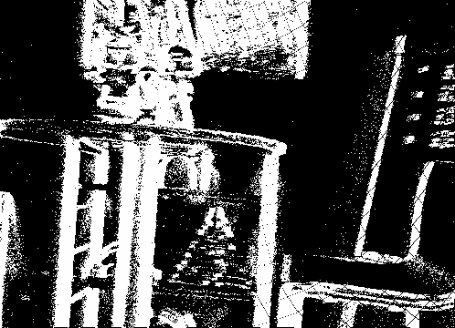
  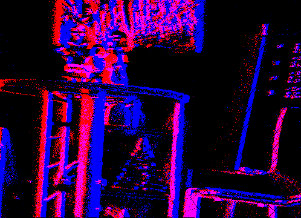
</p>


### Distance Surface

Source: [`ev_representations/distance_transform.py`](ev_representations/distance_transform.py)

The distance surface is purely spatial. The implementation first marks the set of pixels that received at least one event in the selected window, then computes the Euclidean distance from every pixel to the nearest active pixel:

$$
D(x, y) = \min_{(u, v)\in\mathcal{A}} \sqrt{(x-u)^2 + (y-v)^2},
$$

where `A` is the set of active pixels. This representation ignores polarity and the ordering of events within the window; it only preserves where activity occurred.

The code uses `scipy.ndimage.distance_transform_edt`. If the slice is empty, the behavior depends on `no_events_policy`; the demo runner uses `"inf"`.

Example: 

<p align="center">
  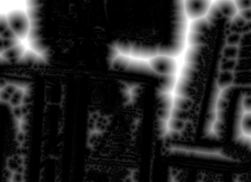
</p>

### Event Count Image

Source: [`ev_representations/event_count_image.py`](ev_representations/event_count_image.py)

This is the simplest dense event representation: a histogram of how many events landed at each pixel. In the non-split case,

$$
C(x, y) = \sum_i \mathbf{1}[x_i = x, y_i = y].
$$

When `split_polarity=True`, the code builds one count map for positive events and one for negative events, and stacks them as `(2, H, W)`.

This preserves spatial event density, but it discards polarity balance and all timing information inside the slice.

Example: `split_polarity=False` (left), `split_polarity=True` (right)

<p align="center">
  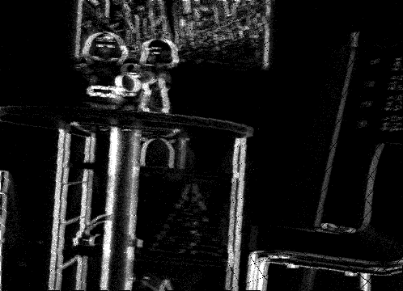
  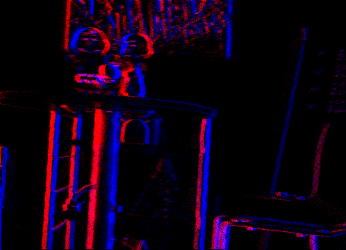
</p>

### Event Polarity Sum Image

Source: [`ev_representations/event_polarity_sum_image.py`](ev_representations/event_polarity_sum_image.py)

Here each event contributes its polarity instead of a unit count, so the pixel value is

$$
S(x, y) = \sum_i p_i \, \mathbf{1}[x_i = x, y_i = y].
$$

Positive and negative events can therefore cancel each other. Large positive values indicate positive events dominate; large negative values indicate negative events dominate.

Compared with the count image, this preserves the direction of the brightness change but still discards temporal ordering.

Example:

<p align="center">
  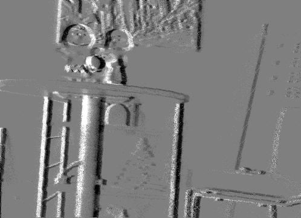
</p>

### Polarity Sum Ternary Image

Source: [`ev_representations/polarity_sum_ternary_image.py`](ev_representations/polarity_sum_ternary_image.py)

This representation starts from the polarity-sum image and keeps only its sign:

$$
T(x, y) = \mathrm{sign}(S(x, y)).
$$

The output values are:

- `+1` if positive events dominate
- `-1` if negative events dominate
- `0` if they balance out or no events are present

Compared with `event_polarity_sum_image`, it deliberately discards magnitude and retains only the dominant sign.

Example:

<p align="center">
  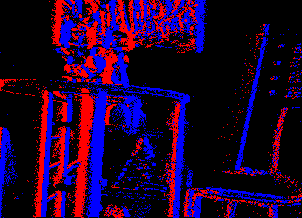
</p>

### Thresholded Polarity Sum Ternary Image

Source: [`ev_representations/polarity_sum_ternary_image.py`](ev_representations/polarity_sum_ternary_image.py)

This is a thresholded version of the previous representation. After computing the polarity sum `S(x, y)`, the code applies

$$
T_\theta(x, y) =
\begin{cases}
1 & \text{if } S(x, y) > \theta, \\
-1 & \text{if } S(x, y) < -\theta, \\
0 & \text{otherwise.}
\end{cases}
$$

Note that the implementation uses strict inequalities, so values with `|S(x, y)| == threshold` are mapped to `0`.

This makes the ternary image less sensitive to weak residual responses.

Example: threshold is set to 5

<p align="center">
  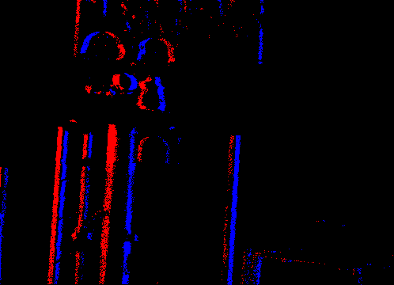
</p>

### Last-Polarity Ternary Image

Source: [`ev_representations/polarity_last_ternary_image.py`](ev_representations/polarity_last_ternary_image.py)

Instead of accumulating all events at a pixel, this representation keeps only the polarity of the most recent one. The code sorts events by time and overwrites the pixel state every time a new event arrives, so the final value at `(x, y)` is the polarity of the last event that hit that pixel. Pixels with no events remain `0`.

This is a latest-state representation: it remembers the newest sign, but it discards both event counts and older temporal history.

Example:

<p align="center">
  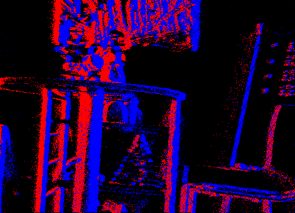
</p>

### Colored Last-Polarity Ternary Image

Source: [`ev_representations/polarity_last_ternary_image.py`](ev_representations/polarity_last_ternary_image.py)

This is a direct colorization of the last-polarity ternary image. The difference between this and the previous representation is that the raw output is different. The color mapping used in the current implementation is:

- negative (`-1`) -> red `[255, 0, 0]`
- zero (`0`) -> white `[255, 255, 255]`
- positive (`+1`) -> blue `[0, 0, 255]`

This mapping can be easily modified in the source code.

Example:

<p align="center">
  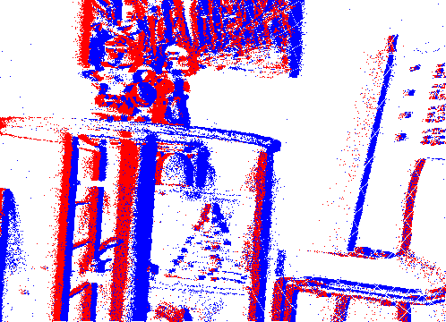
</p>

### Time Surface

Source: [`ev_representations/time_surface.py`](ev_representations/time_surface.py)

The code first builds a Surface of Active Events (SAE), storing the latest timestamp at each pixel separately for positive and negative events. If `SAE_c(x, y)` is the latest timestamp for polarity channel `c`, the time surface is

$$
\mathrm{TS}_c(x, y) =
\begin{cases}
\exp\!\left(-\dfrac{t_{\mathrm{ref}} - \mathrm{SAE}_c(x, y)}{\tau}\right) & \text{if the pixel has at least one event in channel } c, \\
0 & \text{otherwise.}
\end{cases}
$$

The output therefore lies in `[0, 1]`, with values near `1` corresponding to very recent events. In the demo runner, `t_ref` is the end of the sliced window and `tau = 0.1 * (T1 - T0)` in the current implementation.

Example:

<p align="center">
  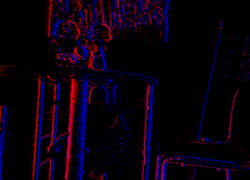
</p>

### Tencode

Source: [`ev_representations/tencode.py`](ev_representations/tencode.py)

Tencode stores polarity and time in one RGB image. In the current implementation, each event is assigned a green value

$$
g_i = 255 \cdot \frac{t_1 - t_i}{t_1 - t_0},
$$

and the last event at each pixel overwrites any earlier one. Positive events write the color `(255, g_i, 0)`, while negative events write `(0, g_i, 255)`.

So polarity is encoded by the red-versus-blue choice, and event time is encoded by the green channel. Because later events overwrite earlier ones, only the most recent event at each pixel is visible in the final image.

Example:

<p align="center">
  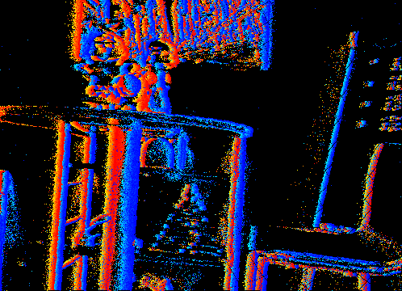
</p>

### Voxel Grid

Source: [`ev_representations/voxel_grid.py`](ev_representations/voxel_grid.py)

The voxel grid maps events onto `B` temporal bins after normalizing event times to

$$
\tilde{t}_i = \frac{t_i - t_0}{t_1 - t_0}(B - 1).
$$

This implementation supports:

- `mode="nearest"` for hard assignment
- `mode="bilinear"` for interpolation between neighboring bins
- `measurement="count"`, `"timestamp"`, or `"polarity"`
- combined or polarity-separated channels

For `nearest`, each event is assigned to the rounded temporal bin. For `bilinear`, each event contributes to the two neighboring bins with weights determined by the fractional part of $\tilde{t}_i$. For `measurement="timestamp"`, the contributed value is the globally normalized event time $(t_i - t_0) / (t_1 - t_0)$.

An important implementation detail is that this code samples `B` time centers on `[t0, t1]`; it is not equivalent to hard slicing the interval into `B` disjoint equal-duration bins.

Example: `split_polarity=False`, `mode="bilinear"`, `measurement="count"`, 3 bins visualized separately

<p align="center">
  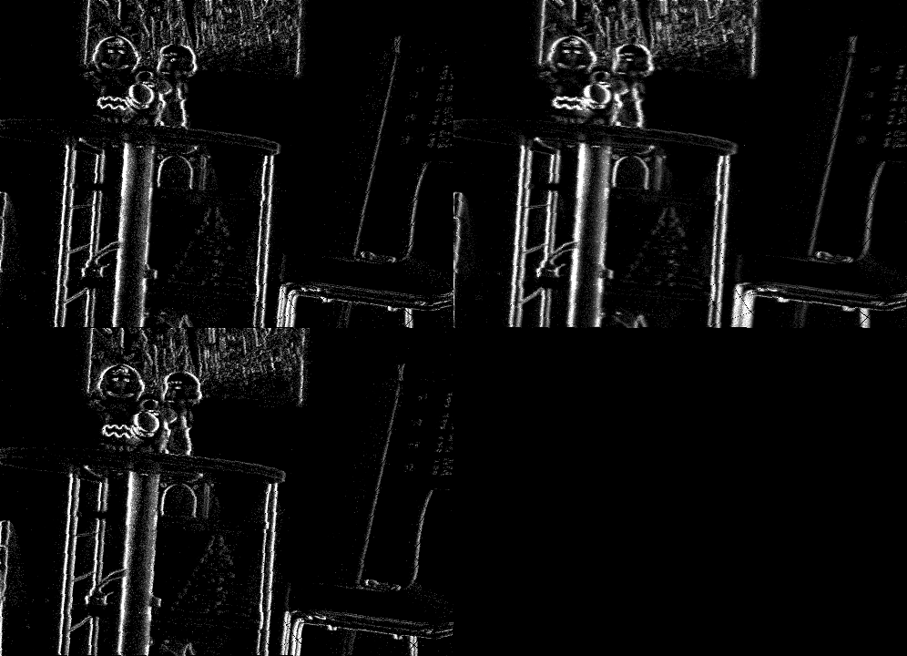
</p>

Example: `split_polarity=False`, `mode="bilinear"`, `measurement="polarity"`, 6 bins

<p align="center">
  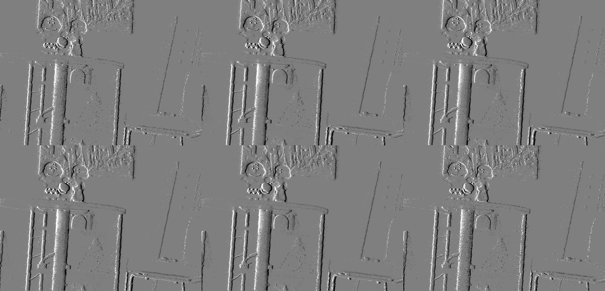
</p>


### Stack by Time

Source: [`ev_representations/stack_by_time.py`](ev_representations/stack_by_time.py)

This representation divides the interval `[t0, t1]` into `B` equal-duration slices using linearly spaced edges, then accumulates events independently inside each slice.

Unlike the voxel grid, there is no interpolation across neighboring temporal bins: each event belongs to exactly one slice.

For `measurement="timestamp"`, the timestamp value is normalized locally inside each slice:

$$
\frac{t_i - \text{edge}_b}{\text{edge}_{b+1} - \text{edge}_b}.
$$

Example: `split_polarity=False`, `measurement="count"`, 3 bins visualized as an RGB image

<p align="center">
  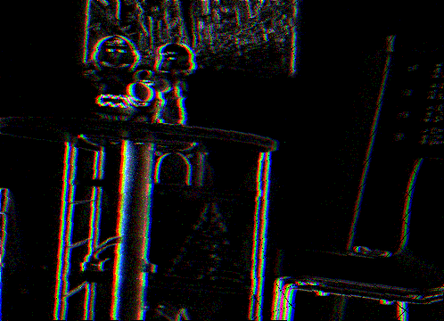
</p>

### Stack by Number

Source: [`ev_representations/stack_by_number.py`](ev_representations/stack_by_number.py)

This representation divides the sorted event stream into `B` contiguous chunks with approximately equal numbers of events. If the slice contains `N` events, the chunk boundaries are chosen from `linspace(0, N, B+1)`.

Compared with stack-by-time, the temporal duration of each chunk is adaptive: high activity produces short time spans and low activity produces long ones.

For `measurement="timestamp"`, timestamps are normalized using the minimum and maximum timestamp within each chunk, so the timestamp values are local to the chunk rather than global.

Example: `split_polarity=False`, `measurement="polarity"`, 3 bins visualized as an RGB image

<p align="center">
  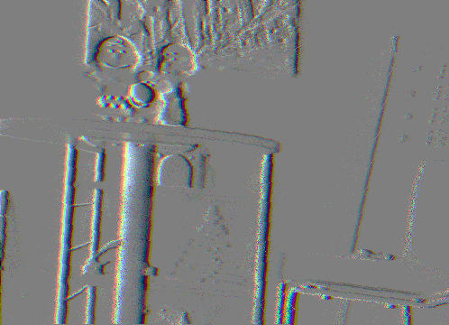
</p>

### Event Spike Tensor (EST-style)

Source: [`ev_representations/event_spike_tensor.py`](ev_representations/event_spike_tensor.py)

This implementation generalizes a voxel-grid-like tensor by allowing different temporal kernels:

- `trilinear`
- `exponential`
- `alpha`

The `trilinear` case is not a separate implementation: it directly calls `voxel_grid(..., mode="bilinear")`. For `exponential` and `alpha`, the code samples temporal bin centers

$$
c_j = t_0 + j \cdot \frac{t_1 - t_0}{B-1}, \qquad j=0,\dots,B-1,
$$

and each event contributes only to future centers inside a finite temporal window. If $\Delta t = c_j - t_i \ge 0$, 
the kernel weights are

$$
w_{\text{exp}}(\Delta t) = \frac{1}{\tau}e^{-\Delta t/\tau},
\qquad
w_{\alpha}(\Delta t) = \frac{\Delta t}{\tau}e^{1-\Delta t/\tau}.
$$

The contributed per-event value can be `1`, the event polarity, or the globally normalized timestamp. In the demo runner, the EST examples use an explicit temporal window that is proportional to `tau`.

Example: `split_polarity=False`, `measurement="timestamp"`, temporal window is 3 times `tau`, 6 bins

<p align="center">
  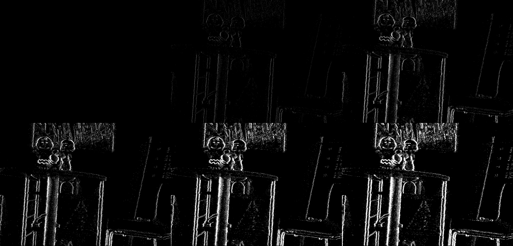
</p>

### Mixed Density Event Stack

Source: [`ev_representations/mixed_density_event_stack.py`](ev_representations/mixed_density_event_stack.py)

Mixed Density Event Stack (MDES) builds nested channels with progressively stronger focus on recent history. If the current slice contains `N_e` events, then channel `c` uses the most recent

$$
n_c = \left\lceil \frac{N_e}{2^c} \right\rceil
$$

events.

So channel `0` aggregates the full slice, channel `1` the most recent half, channel `2` the most recent quarter, and so on. These channels are nested subsets, not disjoint partitions.

For `measurement="timestamp"`, timestamps are normalized inside each selected subset, not globally across the whole slice.

Example: `measurement="polarity"`, 6 bins

<p align="center">
  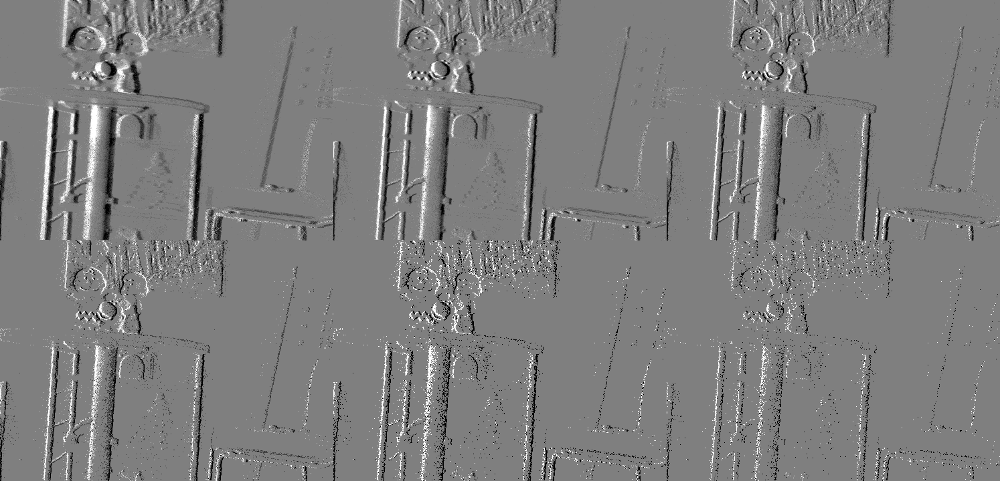
</p>

### TORE Volume

Source: [`ev_representations/tore_volume.py`](ev_representations/tore_volume.py)

TORE maintains, for each pixel and polarity, a FIFO buffer containing the last `K` timestamps observed up to a reference time `t_ref`. If those stored timestamps are `t^(1), ..., t^(K)`, the representation encodes

$$
\log(t_{\mathrm{ref}} - t^{(k)})
$$

for each stored timestamp after optional clipping with `delta_min` and `delta_max`.

The raw tensor therefore stores log time differences rather than counts or brightness-like values. Missing entries are treated as large time differences before the logarithm is applied. In the visualizer, these values are inverted so that more recent events appear brighter in the saved PNGs.

Example: `K = 6`

  - Positive-polarity volume:

<p align="center">
  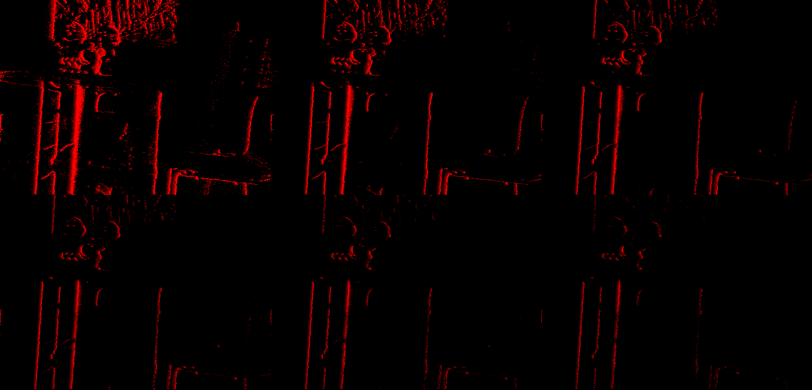
</p>

  - Negative-polarity volume:

<p align="center">
  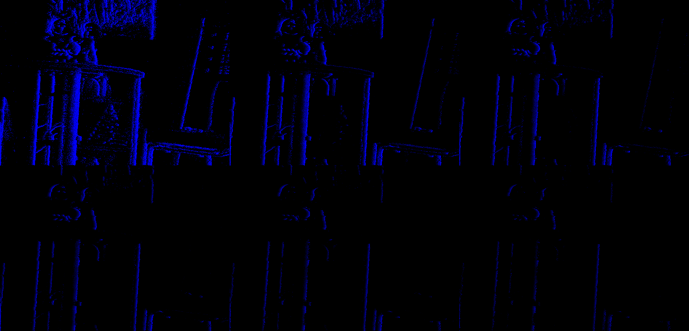
</p>

### Normalized Point Cloud

Source: [`ev_representations/normilized_point_cloud.py`](ev_representations/normilized_point_cloud.py)

This representation keeps the event stream sparse rather than accumulating it onto pixels or bins. Each event is converted to a 4D point

$$
\left(
\frac{x}{W-1},
\frac{y}{H-1},
\frac{t - t_0}{t_1 - t_0},
p
\right),
$$

so the output has shape `(N, 4)` with columns `(x_norm, y_norm, t_norm, p)`.

Unlike the image and tensor representations, every event is kept explicitly. This is useful for point-based models and for geometry-style visualization.

This repo saves:

- `normalized_point_cloud.ply`
- `normalized_point_cloud_xy_views.png`
- `normalized_point_cloud_time_projections.png`

Example: note that the point cloud image here is only for visualziation, the saved point cloud is in a .ply file

<p align="center">
  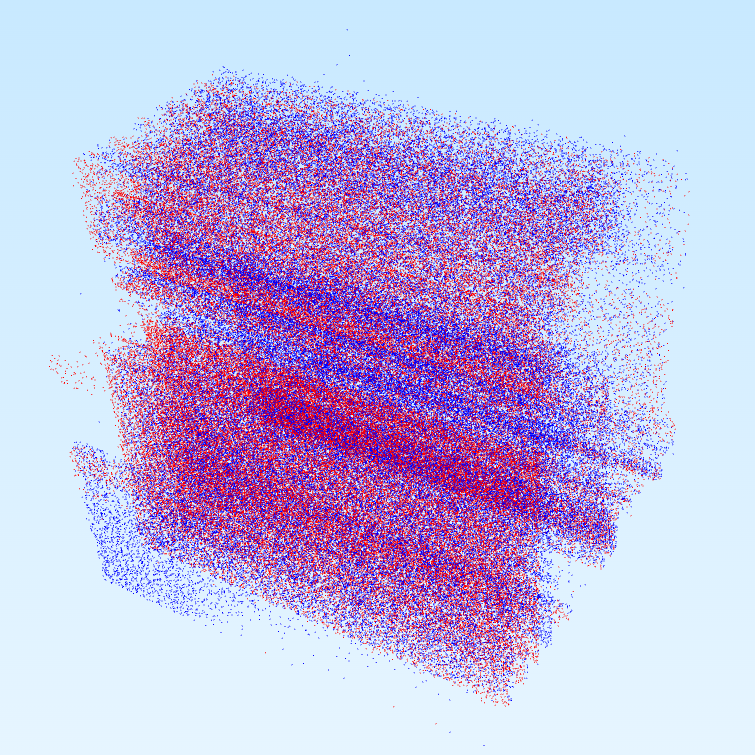
</p>
<p align="center">
  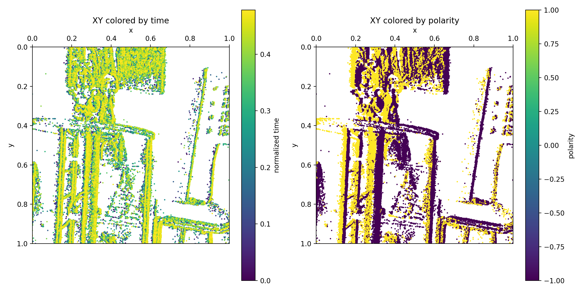
</p>
<p align="center">
  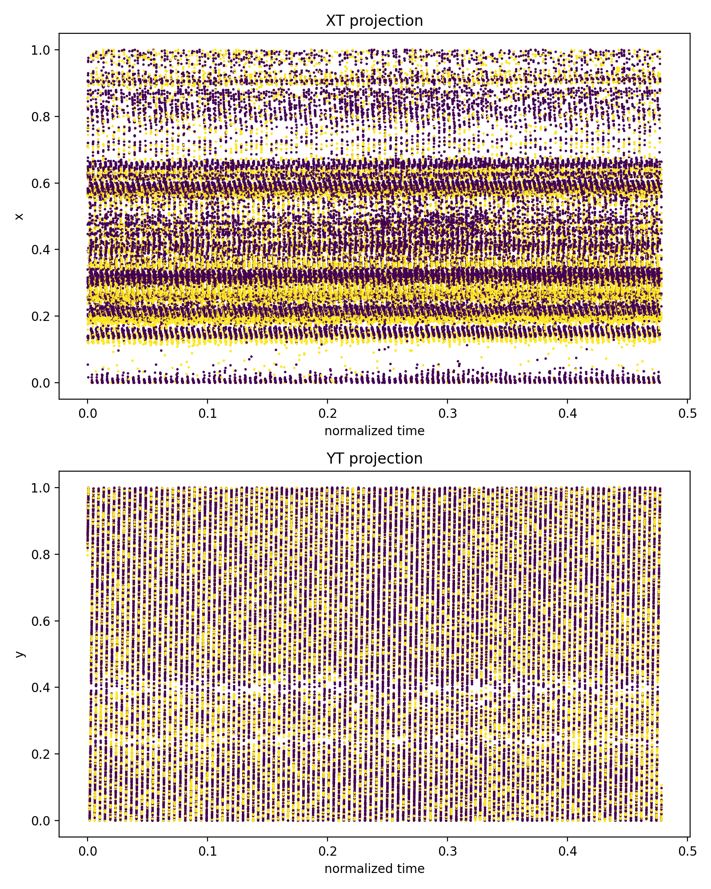
</p>


## References

The event representations implemented in this repo are related to the following papers. For the exact behavior in this repo, always treat the source code as ground truth.

- Voxel-grid style representation: [paper](https://arxiv.org/abs/1812.08156)
- Tencode: [paper](https://arxiv.org/abs/2109.00210)
- Mixed Density Event Stack: [paper](https://openaccess.thecvf.com/content/CVPR2022/html/Nam_Stereo_Depth_From_Events_Cameras_Concentrate_and_Focus_on_the_CVPR_2022_paper.html)
- TORE volume: [paper](https://arxiv.org/abs/2103.06108)
- Event Spike Tensor: [paper](https://arxiv.org/abs/1904.08245)

